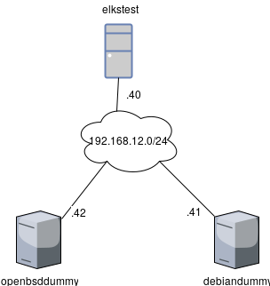

# Test

A Vagrantfile to spin up a VM machine in Virtual Box with an ELKS stack
installed using the roles.

 * `playbook.yml` - The play book used to provision the machine.
 * `Vagrantfile` - Vagrant file for creating the test VM
 * `roles` - Symlink to the roles in root.

# Using

The Vagrant file spins up 3 hosts:

 * `openbsddummy` - an OpenBSD machine to gather log data from.
 * `debiandummy` - a Debian machine to gather log data from.
 * `elkstest` - a Debian machine running the full ELKS stack including Kibana.

To get them running type `vagrant up` in this directory, and everything should
end up with Kibana listening on 192.168.12.40:5601.

# Vagrant

The IP of the ELKS stack is added as a host variable to all machines that are
supposed to send log information.

    ansible.host_vars = {
      "debiandummy" => {
        "elastic_backend_ip" => "192.168.12.40"
      }
    }

## OpenBSD dummy

The OpenBSD box used does not have Python installed, this is needed to use
Ansible, therefore shell provisioning is used to do this.

    od.vm.provision "shell", inline: <<-SHELL
      sudo echo 'installpath = http://ftp.hostserver.de/pub/OpenBSD/6.0/packages/amd64/' > /etc/pkg.conf
      sudo echo 'export PKG_PATH=http://ftp.hostserver.de/pub/OpenBSD/6.0/packages/amd64/' >> ~/.profile
      sudo pkg_add python-2.7.12
      sudo ln -sf /usr/local/bin/python2.7 /usr/local/bin/python
      sudo ln -sf /usr/local/bin/python2.7 /usr/bin/python
      sudo ln -sf /usr/local/bin/python2.7-2to3 /usr/local/bin/2to3
      sudo ln -sf /usr/local/bin/python2.7-config /usr/local/bin/python-config
      sudo ln -sf /usr/local/bin/pydoc2.7  /usr/local/bin/pydoc
     SHELL

The OpenBSD VM is in the group "rsyslog-openbsd" to have Ansible setup the
machine for sending rsyslogs to elkstest.

## Debian dummy

The Debian VM is in the group "rsyslog-debian" to have Ansible setup the
machine for sending rsyslogs to elkstest.

## Debian ELKS test

This machine is in the "elks" group to have the ELKS stack installed by Ansible.

# Ansible

Install a script called `logtest.sh`, used to generate log messages, on all
machines to all machines.

## All running Debian

 * Install Midnight Commander.
 * Install htop.

## All running OpenBSD

 * Install Midnight Commander.
 * Install the nano editor.

## All in the "elks" groups

  * Set time zone.
  * Setup NTP to sync the time from a remote server.
  * Setup the Elks stack backend services.
  * Setup rsyslog to listen for UDP syslog messageg and send them on to
    Logstash
  * Setup Kibana

## All in the "rsyslog-debian"

* Set time zone.
* Setup NTP to sync the time from a remote server.
* Setup rsyslog to send log messages to the remote rsyslog VM.

## All in the "syslog-openbsd"

OpenBSD seems to have NTP running so it is not installed.

 * Set time zone.
 * Setup syslog to send log messages to the remote rsyslog VM.
